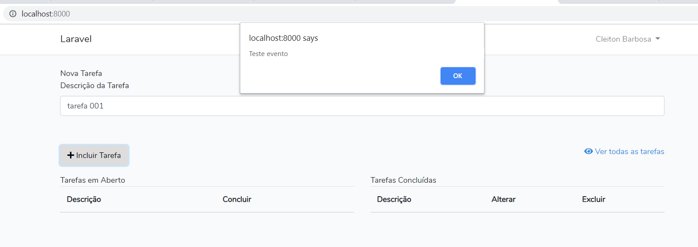
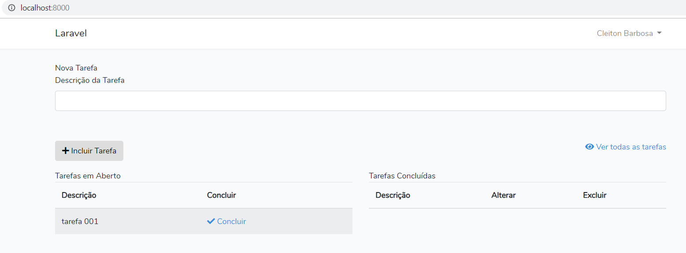
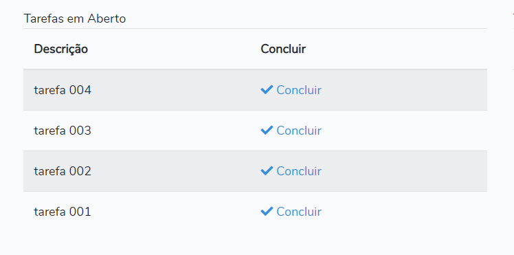

# JavaScript Tutorial

Utilizando o projeto Laravel Tarefas, vamos melhorar a experiência do usuário com um pouco de **JavaScript**

Primeiro devemos incluir a tag `<script><script/>` na nossa _view_ principal do projeto, localizada na pasta _\tarefas\resources\views_


Dentro da tag `<script></script>` declarar na propriedade `src` o caminho do arquivo JavaScript que vamos desenvolver. Perceba que estamos adicionando a propriedade `defer`, ela é utilizada para que o Navegador não espere a execução completa do script para carregar o restante da página. Outra forma de conseguir o mesmo resultado é incluindo a tag ao final do HTML.

Crie um novo arquivo **main.js** no caminho _public\js\\_

Para adicionar algum tipo de interação em uma página, precisamos basicamente selecionar o elemento HTML, adicionar um evento e "interceptar" a ação desse evento, para que possamos adicionar uma função.

 - Primeiro vamos selecionar o formulário da página:

   - Incluir a propriedade `id` na tag `<form></form>`, seguindo o padrão camel-case de nomeclatura, sem espaços ou traços:
    

   - Na versão ES06 o JavaScript é capaz de selecionar um elemento utilizando apenas o `id` declarado na tag:
    

- Adionar o evento:

**public\js\main.js**
```javascript
formAddTarefa.onsubmit
```

- Interceptar a ação do evento:

**public\js\main.js:**
```javascript
formAddTarefa.onsubmit = function (event) {
event.preventDefault()

alert('Teste evento')

formAddTarefa.submit()
}
```
No trecho de código acima, estamos atribuindo uma função "anônima" para o evento que criamos no formuário. Quando o usuário submeter o formulário, nosso script vai passar o _Objeto_ `evento` para nossa função que através da função `preventDefault()` vai _interceptar_ o envio do formulário para a rota definida na tag `<form></form>`, em seguida um alerta é disparado pela função `alert()`, e finalmente o formulário será submetido utilizando a função `submit()`.




Em algumas situações, o elemento HTML que precisamos selecionar é gerado dinâmicamente multiplas vezes, sendo assim não podemos utilizar o `id`, pois não será único. Para contornar este problema precisamos selecionar o elemento através da classe

A lista abaixo, é gerada dinâmicamente pelo `@foreach` do PHP:



**resources\views\tarefas.blade.php**
```html
<table class="table table-striped task-table">
<thead>
    <th>Descrição</th>
    <th>Concluir</th>
</thead>
<tbody id="tbody">
    @foreach($tarefasInc as $tarefa)
    <tr>
        <td>
        {{ $tarefa->description }}
        </td>
        <td>
        <a href="concluir/tarefa/{{ $tarefa->id }}">
            <i class="fa fa-check"></i> Concluir
        </a>
        </td>
    </tr>
    @endforeach
</tbody>
</table>
```
 - Incluir o atributo `class` na tag `<a><a/>` e atribuir um nome para classe que será utilizado no script para selecionar o elemento.

**resources\views\tarefas.blade.php**
```html
<a class="btnConcluir" href="concluir/tarefa/{{ $tarefa->id }}">
    <i class="fa fa-check"></i> Concluir
</a>
```
- Criar um seletor para os elementos da classe `btnConcluir`

**public\js\main.js:**
```javascript
var btnsConcluir = document.querySelectorAll('.btnConcluir')
```
O objeto `document` possui várias propriedades para interagir com o DOM (Document Object Model), que representa a página HTML e todos os seus elementos. Com a função `querySelectorAll()` buscar e selecionar elementos através de `id` ou `class`, basta passar como parâmetro o valor da classe precedido de um `"."` ou do id precedido de um `"#"`.

A função `querySelectorAll()` retorna um Array com todos elementos encontrados para a classe ou id informado, portanto a variável `btnsConcluir` será um Array que podemos iterar, note que o nome da variável está no plural, justamente por ser uma lista com vários _btnConcluir_.

- Adicionar um evento para cada botão

Para adicionar o evento para cada botão do Array precisamos iterar a lista utlizando a função `forEach()` 

**public\js\main.js:**
```javascript
btnsConcluir.forEach(function (btnConcluir){
    btnConcluir.onclick
})
```
A função `forEach()` aceita como parâmetro uma função anônima que por sua vez recebe para cada iteração um item do Array, estamos declarando que o nome de cada item é a própria classe do elemento `btnConcluir`, porém poderia ser qualquer nome, essa forma é apenas para facilitar o entendimento.

Dentro da função anônima, estamos atribuindo o evento `onclick` para cada item da lista.

- Interceptar a ação do evento

**public\js\main.js:**
```javascript
btnsConcluir.forEach(function (btnConcluir){
    btnConcluir.onclick = function (event){
        event.preventDefault()
    }
})
```


